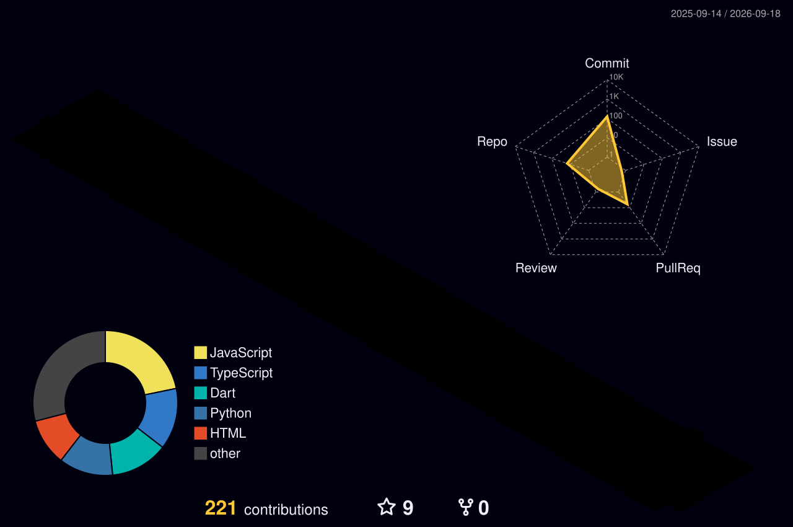

<div align="center">

  <p align="center">
    
  </p>

  <h1>⚡ Shaurya Garg ⚡</h1>
  <p><b>Full-Stack Developer &bull; AI Systems Builder &bull; Cloud Architect</b></p>
  <p><i>Building high-performance full-stack architectures, real-time AI & computer vision systems, and scalable cloud solutions.</i></p>

  <p>
    <a href="https://linkedin.com/in/shaurya-garg-82925a34b"></a>
    <a href="mailto:shauryagargfill0007@gmail.com"></a>
    <a href="https://shauurrya-portfolio.vercel.app"></a>
    <a href="https://leetcode.com/u/Shauurrya"></a>
    <a href="https://codeforces.com/profile/Shauurrya"></a>
  </p>

  <p>
    
  </p>

</div>

---

```bash
$ whoami
shaurya@cyber-core:~$ cat about.txt

┌── [IDENTITY & CORE OVERVIEW]
│ • Display Name   : Shaurya Garg
│ • Role           : Full-Stack Developer & AI Systems Engineer
│ • Location       : Bengaluru, India
│ • Education      : BCA @ CHRIST (Deemed to be University) [2024 - 2027]
│ • Bio / Tagline  : Building at the intersection of high-performance web engineering and intelligent systems.
│
├── [CURRENT FOCUS & INITIATIVES]
│ • Active Project : GestureStrike (Real-time CV arcade game) -> https://github.com/Shauurrya/gesture-strike
│ • Major Systems  : 7-Kaam (AI worker trust engine), Inventra (Cloud ERP), VitalCoreAI (Biometrics engine)
│ • Learning Goals : Distributed Systems, Scalable Cloud Architectures & Applied AI/ML
│ • Origin Story   : Started by hacking together retro games and algorithms; now engineering production-ready web and mobile ecosystems.
│
└── [ACCESS POINTS & COMMS]
    • Portfolio    : https://shauurrya-portfolio.vercel.app
    • Direct Comms : shauryagargfill0007@gmail.com
    • Status       : Open for impactful engineering opportunities & technical collaborations
```

---

<div align="center">
  <h3>~/ toolbox</h3>
  <br/>
  <a href="https://skillicons.dev">
    
  </a>
</div>

---

<div align="center">
  <h3>~/ isometric activity grid</h3>
  <br/>
  <picture>
    <source media="(prefers-color-scheme: dark)" srcset="./profile-3d-contrib/profile-night-rainbow.svg">
    <source media="(prefers-color-scheme: light)" srcset="./profile-3d-contrib/profile-night-rainbow.svg">
    
  </picture>
</div>

---

<div align="center">
  <h3>~/ the numbers</h3>
  <br/>
  <p align="center">
    
    &nbsp;
    
  </p>
</div>

---

<div align="center">
  <sub>⚡ Engineered with precision by <b>Shaurya Garg</b> (<code>@Shauurrya</code>)</sub>
</div>
